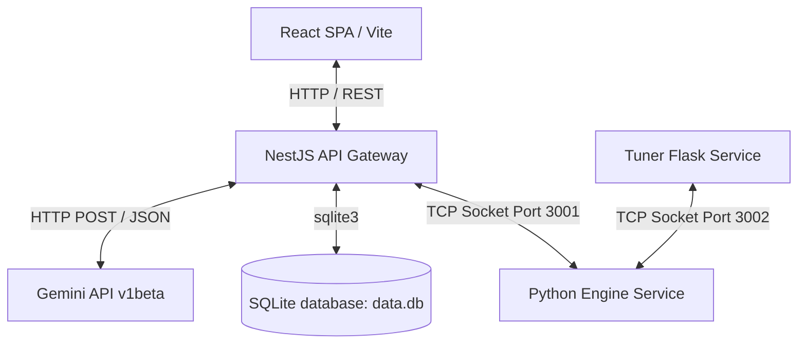

# Falcon Engineering Implementation & Architecture Plan

## 1. System Architecture & Tech Choices
Falcon is implemented as a containerized microservices application consisting of four key services orchestrated via Docker Compose:

* **Frontend (React, Vite, TypeScript, Vanilla CSS):**
  * *Choice:* Chosen for low bundle sizes, rapid development, and rich TypeScript types.
  * *Layout:* Multi-page views (Welcome, Upload, Logs, AI Hub) styled with custom responsive glassmorphism CSS variables to ensure visual premium aesthetics.
* **API Gateway & Orchestration (NestJS, TypeScript, SQLite):**
  * *Choice:* Structured, scalable architecture that provides asynchronous microservice interfaces.
  * *Data Persistence:* SQLite (`sqlite3`) is used for transactional data.db, storing analyst triage decisions, departments, and user profiles.
* **Detection Engine (Python, Pandas, Scikit-learn, Raw Sockets):**
  * *Choice:* Standard data science tools (`pandas` for feature engineering, `scikit-learn` for unsupervised Isolation Forest).
  * *Inter-process Communication:* Employs a low-overhead, multi-threaded raw TCP server using a 4-byte big-endian length-prefixed JSON/CSV payload protocol.
* **Risk Configuration Controller (Python, Flask):**
  * *Choice:* Lightweight micro-framework for proxying configurations via raw TCP (port 3002) to the Python engine.

---

## 2. Dynamic Interactions & Data Flows
1. **Transaction Processing Flow:** 
   `User Uploads CSV` $\rightarrow$ `React App` $\rightarrow$ `NestJS /engine/upload` $\rightarrow$ `TCP Socket Send (Port 3001)` $\rightarrow$ `Python Engine (Feature Eng. + ML scoring)` $\rightarrow$ `TCP Response` $\rightarrow$ `NestJS mapping` $\rightarrow$ `React UI & SQLite state updates`.
2. **Configuration Tuning Flow:** 
   `Risk Engineer changes slider` $\rightarrow$ `Tuner UI (Port 5555)` $\rightarrow$ `Flask route` $\rightarrow$ `TCP Socket (Port 3002)` $\rightarrow$ `Python engine configuration in-memory update` $\rightarrow$ `Saved to config.json`.
3. **GenAI Investigation Flow:** 
   `Analyst opens chat panel` $\rightarrow$ `Enter question` $\rightarrow$ `NestJS /engine/chat` $\rightarrow$ `Optionally triggers Wikipedia keyword search` $\rightarrow$ `Injects context (tx details, search results)` $\rightarrow$ `Gemini API query` $\rightarrow$ `Analyst gets diagnostic response`.

---

## 3. Team Work Division (4 Engineers)
To execute this workspace parallelly over a 2-week sprint, tasks were divided as follows:
* **Engineer 1 (Data & Analytics Lead - Python Engine):**
  * Developed the 15 deterministic compliance rules in `python/engine.py`.
  * Integrated the Isolation Forest anomaly detector and standard pipeline statistics (Accuracy, Precision, Recall, F1).
  * Wrote the TCP network listener for binary/text data transfer on port 3001.
* **Engineer 2 (Backend Gateway Engineer - NestJS & DB):**
  * Created the NestJS application structure, controllers, and SQLite database layers.
  * Implemented CSV buffer parsing and microservice TCP connections to python.
  * Configured Gemini SDK integration and Wikipedia search helper tools.
* **Engineer 3 (Frontend UX Engineer - React UI):**
  * Formulated the custom visual CSS style theme system.
  * Programmed the reactive dashboards, grid filters, and Mapbox map routes.
  * Designed the interactive slide-out panel, logs viewer, and chat client.
* **Engineer 4 (Infrastructure & Systems - Docker & Tuner):**
  * Formulated Dockerfiles and the top-level `docker-compose.yaml`.
  * Designed the lightweight Python Flask "Tuner" dashboard (port 5555) to manage configuration updates over socket port 3002.

---

## 4. Architectural Exclusions & Trade-offs (What We Skipped & Why)
1. **No Distributed Message Broker (e.g., Kafka or RabbitMQ):**
   * *Why:* Standard async message queues would introduce operational overhead. Raw socket TCP streams are lightweight, provide simple framing, and support concurrent workloads using Python threading.
2. **No User Password Hashing (Plain-text SQLite):**
   * *Why:* Bypassed for MVP simplicity. The project is focused on demo-level sandboxed environments. In production, bcrypt or external Identity Providers (Auth0/Keycloak) are mandatory.
3. **No Stateful In-Memory Cache (e.g., Redis):**
   * *Why:* Transactions are held in-memory inside the NestJS service instances after upload. Since there is no distributed deployment scale, local state meets processing requirements.
4. **No Hot-Reloading of Machine Learning Model Pickle:**
   * *Why:* The Isolation Forest model trains dynamically on each uploaded dataset rather than using a pre-saved `.pkl` object. This simplifies model drift issues but adds runtime CPU overhead.
